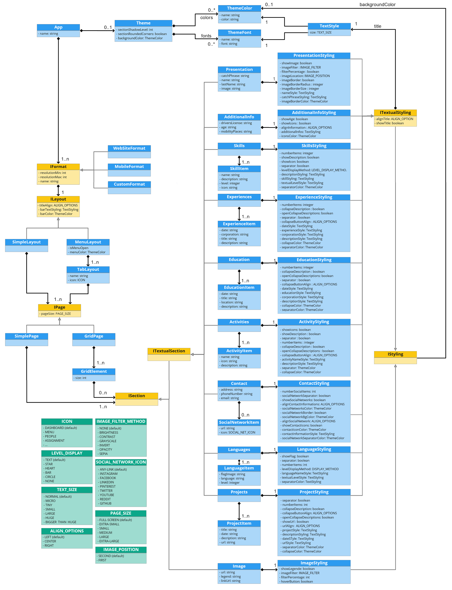

# 🇩.🇸.🇱 - (UXifier-Language)

<p align="center" width="100%">
     
</p>

## Team ADSL2

Members | Contact
----------------------------------------------------------- | ----------------------------------------------------------
[Anthony Barna](https://github.com/Anthony-Barna)           | [anthony.barna@etu.univ-cotedazur.fr](mailto:anthony.barna@etu.univ-cotedazur.fr)
[Leo Burette](https://github.com/LeoBurette)                | [leo.burette@etu.univ-cotedazur.fr](mailto:leo.burette@etu.univ-cotedazur.fr)
[Lara Defendini](https://github.com/Laradefendini)          | [lara.defendini@etu.univ-cotedazur.fr](mailto:lara.defendini@etu.univ-cotedazur.fr)
[Guillaume Savornin](https://github.com/GuillaumeSavornin)  | [guillaume.savornin@etu.univ-cotedazur.fr](mailto:guillaume.savornin@etu.univ-cotedazur.fr)
[Anton van der Tuijn](https://github.com/Anton-vanderTuijn) | [anton.van-der-tuijn@etu.univ-cotedazur.fr](mailto:anton.van-der-tuijn@etu.univ-cotedazur.fr)

## Project structure

- The ```UXifier-Language``` directory contains our DSL source code
- The ```WebSite``` directory contains our React application
- The ```document``` directory contains the subject and our report

---

## Domain model represented as a class diagram



## How to run the project

Jetbrains MPS is required.

Clone this project after what open the ```UXifier-Language``` directory with MPS.
Then select ```Logical View``` to visualize the projet files, right-click on the root folder ```UXifier-Language``` and select ```Rebuild Project```.

Some scenarios can be found in the project's sandbox at ```UXifier.sandbox/UXifier/sandbox```. To run them, right-click on a scenario in the project's sandbox and select ```Preview Generated Text``` to see the generated source code for the CV.

To visualize the CV copy paste the generated source code into ```WebSite/src/index.js```. Move into the ```WebSite``` directory and execute ```npm i``` and ```npm run start``` commands. The CV will be displayed by default at the following address http://localhost:3000/.

New script can be created doing a right-clicking on the project's sandbox and selecting a new ```App```.

### Syntax (Extended Backus–Naur form)

```java
<Presentation> = “Presentation section:” <PresentationStyling>;
<AdditionalInfo> = “Additional Information Section:” <AdditionalInfoStyling>;
<Skills> = “Skills Section:” <SkillsStyling>;
<Experiences> = “Experiences Section:” <ExperiencesStyling>;
<Education> = “Education Section:” < Education Styling>;
<Activities>   = “Activities Section:” < ActivitiesStyling>;
<Contact> = “Contact Section:” < ContactStyling>;
<Languages> = “Languages Section:” < LanguagesStyling>;
<Projects> = “Image Section:” <ImageStyling>;
<Image> = “Additional Information Section:” <AdditionalInfoStyling>;
<TextualSection> = <Presentation> | <AdditionalInfo> | <Skills> | <Experiences> | <Education> | <Activities> | <Contact> | <Languages> | <Projects>;
<Section> = <TextualSection> | <Image>;

<PresentationStyling> = 
    “show title:” <Boolean> <String>
        “align title:” <ALIGN_TITLE>
    “background color:” <String>
    “name style:” <String>
    “catch phrase style:” <String>
    “show image:” <Boolean>
        “image position:” <IMAGE_LOCATION>
        “image filter:” <IMAGE_FILTER>
            “filter percentage:” <Integer>
        “image border:” <Boolean>
            “border color:” <String>
            “border size (px):” <Integer>
            “border radius (px):” <Integer>;
<AdditionalInfoStyling> = 
    “show title:” <Boolean> <String>
        “alignment:” <ALIGN_TITLE>
    “background color:” <String>
    “additional informations style:” <TextStyling>
    “show icons:” <Boolean> “[C]:” <String>
    “show age:” <Boolean>
    “align additional information:” <ALIGN_TITLE>;
<SkillsStyling> = 
    “show title:” <Boolean> <String>
        “alignment:” <ALIGN_TITLE>
    “background color:” <String>
    “skill name style:” <TextStyling>
    “show icon:” <Boolean>
    “show description:” <Boolean> <TextStyling>
    “show separator:” <Boolean>  “[C]:” <String>
    “level display method:” <Integer> <TextStyling>
    “number of skills:” <Integer>;
<ExperiencesStyling> = 
    “show title:” <Boolean> <String>
        “alignment:” <ALIGN_TITLE>
    “background color:” <TextStyling>
    “experience name style:” <TextStyling>
    “date style:” <TextStyling>
    “corporation name style:” <TextStyling>
    “description style:” <TextStyling>
    “collapse description:” <Boolean>  “[C]:” <String>
        “open all:” <Boolean>
        “button alignment:” <ALIGN_OPTIONS>
    “show separator:” <Boolean>  “[C]:” <String>
    “number of experience:” <Integer>;
<EducationStyling> = 
    “show title:” <Boolean> <String>
        “alignment:” <ALIGN_TITLE>
    “background color:” <TextStyling>
    “education name style:” <TextStyling>
    “date style:” <TextStyling>
    “school name style:” <TextStyling>
    “description style:” <TextStyling>
    “collapse description:” <Boolean>  “[C]:” <String>
        “open all:” <Boolean>
        “button alignment:” <ALIGN_OPTIONS>
    “show separator:” <Boolean>  “[C]:” <String>
    “number of educations:” <Integer>;
<ActivitiesStyling>   = 
    “show title:” <Boolean> <String>
        “alignment:” <ALIGN_TITLE>
    “background color:” <TextStyling>
    “education name style:” <TextStyling>
    “date style:” <TextStyling>
    “school name style:” <TextStyling>
    “description style:” <TextStyling>
    “collapse description:” <Boolean>  “[C]:” <String>
        “open all:” <Boolean>
        “button alignment:” <ALIGN_OPTIONS>
    “show separator:” <Boolean>  “[C]:” <String>
    “number of activities:” <Integer>;
<ContactStyling> =
    “show title:” <Boolean> <String>
        “alignment:” <ALIGN_TITLE>
    “background color:” <TextStyling>
    “contact element style:” <TextStyling>
    “align contact information:” <ALIGN_TITLE>
    “show contact icons:” <Boolean> “[C]:” <String>
    “show social networks:” <Boolean>
        “icon color:” <String>
        “background color:” <String>
        “border:” <Boolean>
        “alignment:” <ALIGN_TITLE>
        “show separator:” <Boolean> “[C]:” <String>
        “number of social networks:” <Integer>;
<LanguagesStyling> =
    “show title:” <Boolean> <TextStyling>
        “alignment:” <ALIGN_OPTIONS>
    “background color:” <String>
    “language name style:” <TextStyling>
    “show flags:” <Boolean>
    “show separator:” <Boolean> “[C]:” <String>
    “level display method:” <LEVEL_DISPLAY_METHOD>
    “number of languages:” <Integer>;
<ProjectsStyling> =
    “show title:” <Boolean> <TextStyling>
        “alignment:” <ALIGN_OPTIONS>
    “background color:” <String>
    “project name style:” <TextStyling>
    “date style:” <TextStyling>
    “description style:” <TextStyling>
    “collapse description:” <Boolean> “[C]:” <String>
        “open all:” <Boolean>
        “button alignment:” <ALIGN_OPTIONS>
    “show button ‘go to project’:” <Boolean> <TextStyling>
        “alignment:” <ALIGN_OPTIONS>
    “show separator:” <Boolean> “[C]:” <String>
    “number of projects:” <Integer>;
<ImageStyling> = 
    “background color:” <String>
    “show legend:” <Boolean> <TextStyling>
    “hover image button:” <Boolean>
    “align additional informations:” <ALIGN_OPTIONS>;
<TextStyling> = <PresentationStyling> | <AdditionalInfoStyling> | <SkillsStyling> | <ExperiencesStyling> | <EducationStyling> | <ActivitiesStyling> | <ContactStyling> | <LanguagesStyling> | <ProjectsStyling>;
<Styling> = <TextualStyling> | <ImageStyling>;

<GridElements> = 
    “Size” <Integer> “/ 12”
    (<Section>)*;
<GridPage> = 
    “Grid page:    width:” <Integer>
        (<GridElements>)+;
<SimplePage> = 
    “Simple page:    width:” <Integer>
    (<Section>)+;
<Page> = <GridPage> | <SimplePage>;

<TabLayout> = 
    “Tab “<String>     “icon:” <Icon> 
    (<Page>)+;
<MenuLayout> = 
    “Menu layout:    menu open:” <Boolean>
        “style:” 
            “top bar:”
                “color:” <String>
                “text:” <TextStyling>
                “alignment:” <ALIGN_OPTIONS>
            “menu:” <String>
        (<TabLayout>)+;
<SimpleLayout> = 
    “Layout:”
        “style:”
            “color:” <String>
            “text:” <TextStyling>
            “alignment:” <ALIGN_OPTIONS>
        (<Page>)+;
<Layout> = < MenuLayout> | <SimpleLayout>;
<WebSiteFormat> = “Website format:” <Layout>;
<MobileFormat> = “Mobile format:” <Layout>;
<CustomFormat> = <String> “format: resolution range: [” <Integer> ”,” <Integer> “]” <Layout>;
<Format> = <WebSiteFormat> | <MobileFormat> | <CustomFormat>;
<ThemeColor> = “name:” <String> “color:” <String>;
<ThemeFont> = “name:” <String> “font:” <String>;
<TextStyling> = “[F]:” <String> “[C]:” <String> “[S]:” < String>;
<Theme> = 
    “colors:” (<ThemeColor>)*
    “fonts:” (<ThemeFont>)*
   “section:”
        “shadow level:” <Integer>
        “rounded corners” <Boolean>
    “background color:” <ThemeColor>;
<App> = 
    “Application” <String>
        “Theme”: (<Theme>)?
        (<Format>)+;

<ALIGN_OPTIONS> = “LEFT” | “CENTER” | “RIGHT”;
<ICON> = “DASHBOARD” | “MENU” | “PEOPLE” | “ASSIGNMENT” | “ARROW-RIGHT-1” | ”ARROW-RIGHT-2” | “FACE” | “FILE” | “FLOWER” | “PICTURE” | “SPORT” | “WORK” | “STAR”;
<IMAGE_FILTER> = “NONE” | “BRIGHTNESS” | “CONTRAST” | “GRAYSCALE” | “INVERT” | “OPACITY” | “SEPIA”;
<IMAGE_POSITION> = “SECOND” | “FIRST”;
<LEVEL_DISPLAY_METHOD> = “TEXT” | “STAR” | “HEART” | “BAR” | “CIRCLE” | “NONE”;
<PAGE_SIZE> = “FULL-SCREEN” | “EXTRA-SMALL” | “SMALL” | “MEDIUM” | “LARGE” | “EXTRA-LARGE”;
<SOCIAL_NETWORK_ICON> = “ANY-LINK” | “INSTRAGRAM” | “FACEBOOK” | “LINKEDIN” | “PINTEREST” | “TWITTER” | “YOUTUBE” | “REDDIT” | “GITHUB”;
<TEXT_SIZE> = “NORMAL” | “MICRO” | “TINY” | “SMALL” | “LARGE” | “HUGE” | “BIGGER_THAN_HUGE”; 
```

#### Table of symbols

Notation | Usage
------------------ | ---------------- 
=                  | definition
;                  | termination
&#124;             | alternation
( ... )            | grouping
" ... "            | terminal string
( ... )*           | zero or more
( ... )+           | one or more

#### Syntax example

```java
TBD
```

### Scenarios implemented

TBD

### Requirements

- [MPS](https://www.jetbrains.com/mps/)
- [Node.js](https://nodejs.org/en/)

<!--

---
## Distribution of points (500)

Member | Points
----------------------------------------------------------- | ----------------------------------------------------------
[Anthony Barna](https://github.com/Anthony-Barna)           | X
[Leo Burette](https://github.com/LeoBurette)                | X
[Lara Defendini](https://github.com/Laradefendini)          | X
[Guillaume Savornin](https://github.com/GuillaumeSavornin)  | X
[Anton van der Tuijn](https://github.com/Anton-vanderTuijn) | X
-->

---


